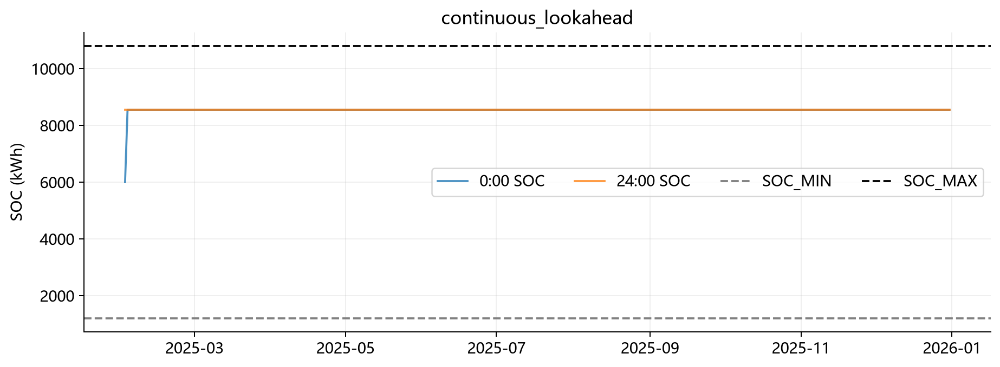

# 跨日 SOC 模型比较与复核报告

评价期：2025-02-01 至 12-31，334 天。运行环境：D:/Anaconda/envs/cucum2026，Python 3.13.15，SciPy HiGHS。所有原正式附件保持不变。

## 1. 原题、旧假设与初始化

原题第 1 页问题 1 明确要求 0:00 与 24:00 储电量相同；问题 2 没有要求沿用全部约束，也没有每日 6000 闭合条件。因此每日闭合是旧建模假设。第 2 页附录 1 明确 2025-01-01 初始 SOC=6000，不能省略这一事实。详见 `docs/SOC_boundary_audit.md`。

旧假设由 Q2 config/optimizer/pipeline/validator/exporter、Q3 optimizer/controller/validator/exporter 继承，再由 Q4 两个适配器复用。Q1 源码及 result1.xlsx 均逐文件与 HEAD 对比未变。

主实验用 feb1_control_start；可选 jan1_continuous 使用 1 月储能空闲、残余负荷在线平衡的 warm-up，同样从 2 月初 6000 运行，故正式期结果数值相同。warm-up 不优化未来真实数据，逐日记录见 initialization/jan1_continuous_warmup.csv。

## 2. Q2 三种模型

| SOC 模式 | 总费用/元 | 紧急电量/kWh | 日末均值/kWh | 午夜近下界天数 | 吞吐/kWh |
| --- | --- | --- | --- | --- | --- |
| daily_closed | 17,609,791.69 | 477,446.06 | 6,000.00 | 0 | 13,546,814.98 |
| continuous_myopic | 17,632,638.40 | 477,446.06 | 1,200.00 | 334 | 13,541,481.64 |
| continuous_lookahead | 17,719,866.95 | 516,941.19 | 8,550.00 | 0 | 13,545,414.77 |

continuous_myopic 比旧模型贵 22,846.72 元，334 天午夜全部为 1200，表现出明显单日自由终端耗尽。取消约束并未降低实际总费用。

48h continuous_lookahead 比旧模型贵 110,075.26 元（0.6251%），紧急电量变化 39,495.13 kWh。日末全部为 8550，近下界天数为 0；8550 由 LP 得到，没有人为目标或软惩罚。

单日版本吞吐下降主要包含初末库存差，旧模型相对 48h 的吞吐差也很小，不能声称每日闭合必然造成大量无效循环。48h 允许前一天为次日储电，但在这组实际数据上的净收益未转化为全年更低费用。31 日样本变为 30 个相邻日对也改变了首日经验分布，费用差不能全部归因于 SOC。

## 3. Q3 新消融与剩余问题

| 更新时间 | 费用/元 | 紧急电量/kWh | 调整净费/元 | 午夜近下界天数 |
| --- | --- | --- | --- | --- |
| 0 | 17,438,478.47 | 403,037.57 | 0.00 | 334 |
| 0+6 | 17,167,407.26 | 320,257.18 | 20,422.02 | 334 |
| 0+6+12 | 17,089,614.36 | 301,533.07 | 13,883.13 | 334 |
| 0+6+12+18 | 17,089,636.01 | 301,554.57 | 13,801.56 | 334 |
| 0+12+18 | 17,182,528.95 | 342,817.78 | -40,597.83 | 334 |
| 0+6+18 | 17,167,568.20 | 320,356.36 | 20,115.66 | 334 |

新最优策略为 0+6+12，年度费用 17,089,614.36 元，比旧 Q3 高 69,307.71 元。原 0+6+12 结论在本次重算中仍成立；加入 18 点只增加 21.65 元，差距极小，不宜外推为稳定规律。

新 Q3 在 6/12/18 点均规划未来 24h，交易仅作用于当日剩余合同。每条历史误差轨迹均已完整发生。尽管如此，六种策略都在午夜达下界。午夜对修订计划已经不是 horizon 末端，可能涉及当日增购 1.5 倍/退款 0.5 倍与次日新购 1 倍的不对称，且 0 点计划仍有自由日末终端。因此不能宣称跨午夜预测已经消除所有短视问题，也不能把此轨迹证明为长期最优。

策略按同一全年评价数据回溯选择，未使用未来值制定逐时调度，但策略选择本身不是样本外验证。

## 4. Q4：相同 SOC 与策略下固定/动态对照

### question4_2

| SOC 模式 | 价格 | 费用/元 | 日末平均/kWh | 近下界天数 |
| --- | --- | --- | --- | --- |
| daily_closed | fixed | 17,609,791.69 | 6,000.00 | 0 |
| daily_closed | dynamic | 17,923,538.09 | 6,000.00 | 0 |
| continuous_lookahead | fixed | 17,719,866.95 | 8,550.00 | 0 |
| continuous_lookahead | dynamic | 18,039,943.66 | 4,542.07 | 23 |

新动态减新固定费用：320,076.71 元。提前已知次日价格的条件敏感性费用：18,013,371.04 元。该敏感性使用未来价格，仅在价格提前发布假设下成立；主模型不读取次日实际价格。

### question4_3

| SOC 模式 | 价格 | 费用/元 | 日末平均/kWh | 近下界天数 |
| --- | --- | --- | --- | --- |
| daily_closed | fixed | 17,020,306.65 | 6,000.00 | 0 |
| daily_closed | dynamic | 17,244,554.43 | 6,000.00 | 0 |
| continuous_lookahead | fixed | 17,089,614.36 | 1,200.00 | 334 |
| continuous_lookahead | dynamic | 17,314,363.16 | 1,212.61 | 331 |

新动态减新固定费用：224,748.80 元。提前已知次日价格的条件敏感性费用：17,313,028.21 元。该敏感性使用未来价格，仅在价格提前发布假设下成立；主模型不读取次日实际价格。

当日完整动态价格已知仍为显式建模假设；题面没有给出价格发布制度。主模型用当日曲线持续预测下一天。12 月 31 日无 2026 价格，敏感性也退回持续预测。不能把价格未知的现实市场表现等同于此实验。

## 5. Benchmark

| 边界 | 方法 | 费用/元 | 紧急电量/kWh | 日末均值/kWh |
| --- | --- | --- | --- | --- |
| legacy_daily_closed | DET | 25,136,685.52 | 3,265,026.80 | 6,000.00 |
| legacy_daily_closed | Q80 | 17,735,841.90 | 537,269.07 | 6,000.00 |
| legacy_daily_closed | SAA | 17,609,791.69 | 477,446.06 | 6,000.00 |
| legacy_daily_closed | CVaR-SAA | 17,491,681.53 | 324,133.13 | 6,000.00 |
| legacy_daily_closed | SAA-MPC | 17,020,306.65 | 282,085.64 | 6,000.00 |
| continuous_soc | DET | 25,266,719.44 | 3,297,948.91 | 7,778.34 |
| continuous_soc | Q80 | 17,844,768.27 | 567,299.77 | 8,550.00 |
| continuous_soc | SAA | 17,719,866.95 | 516,941.19 | 8,550.00 |
| continuous_soc | CVaR-SAA | 17,586,905.12 | 368,230.50 | 8,550.00 |
| continuous_soc | SAA-MPC | 17,089,614.36 | 301,533.07 | 1,200.00 |

legacy_daily_closed 费用排序：SAA-MPC < CVaR-SAA < SAA < Q80 < DET。

continuous_soc 费用排序：SAA-MPC < CVaR-SAA < SAA < Q80 < DET。

仓库没有旧 benchmark 源码/存档，因此 legacy 是在旧边界下重建的对照，不能声称精确复现不存在的旧 benchmark。CVaR 风险项为场景紧急费用的 95% CVaR，权重 0.1，未按结果调参；lambda=0 已测试严格退化为新 SAA。MPC 多了已发布预测与调整机制，排序不等于纯求解算法优劣。

## 6. 年末库存与估值敏感性

| Q2 模式 | 末 SOC | 原费用 | 低价估值调整 | 均价估值调整 | 高价估值调整 |
| --- | --- | --- | --- | --- | --- |
| daily_closed | 6,000.00 | 17,609,791.69 | 17,609,791.69 | 17,609,791.69 | 17,609,791.69 |
| continuous_myopic | 1,200.00 | 17,632,638.40 | 17,634,242.42 | 17,635,948.38 | 17,638,665.67 |
| continuous_lookahead | 8,550.00 | 17,719,866.95 | 17,719,014.81 | 17,718,108.53 | 17,716,664.96 |

调整费用 = 原费用 − v × (年末 SOC − 初始 SOC)，v 为正常价格低/均/高值乘 0.9；三组同时报告，不进入优化、不反向调参。Q3/Q4/benchmark 同样的估值字段保存在各 summary 或 soc_boundary_diagnostics.json。年末未强制回 6000。

## 7. 验证与修改范围

完整 unittest：83 项，全部通过。逐日存档验证 31 组实验，每组 334 天；全部跨日 SOC 最大误差为 0 kWh。每个 LP 在求解后校验场景平衡、SOC 动态、边界、目标；持久化结果再次重放验证冻结执行与费用。

| 旧模型回归 | 费用差/元 | 逐日最大数值差 |
| --- | --- | --- |
| question3 | 0.0 | 0.0 |
| question4/question4_2 | 0.0 | 0.0 |
| question4/question4_3 | 0.0 | 0.0 |
| question2 | 0.0 | 7.275957614183426e-12 |

全部候选 Excel 已重新打开，核对每一天的 144 槽购电、费用、电量总计、6 段充放电及初末 SOC；误差记录于 verification.json。Q1 源码与 5 个原正式附件逐文件对比 HEAD 未变。主调度的历史场景、未发布预测及跨午夜未来实际数据隔离测试通过；提前知价敏感性和全年回溯选策略已单独披露，不能混称为无未来信息。

核心改动：Q2 config/types/scenario_builder/optimizer/pipeline/validator/exporter/summary；Q3 types/rolling_scenario_builder/optimizer/rolling_controller/analysis/validator/exporter/summary/storage；Q4 两个适配器与 validator；共享 pricing、soc_initialization、soc_diagnostics；新增 run_revised_soc.py、verify_revised_soc.py、连续模型测试与两份模型说明。

## 8. 论文与候选附件建议

建议论文采用显式跨日状态作为物理口径，以 Q2 48h SAA 为候选，同时保留 daily_closed 与 myopic 两种敏感性，坦诚报告费用上升。Q3/Q4-3 可使用新连续滚动模型的候选结果，但必须保留午夜耗尽、合同不对称与回溯选策略的局限，不把它包装成终端效应已完全消除的最终理论结论。

候选替换组：本目录 result2.xlsx、result3.xlsx、result4-2.xlsx、result4-3.xlsx，均使用 continuous_lookahead，Q3/Q4-3 用本次选出的 0+6+12，Q4 用当日价格持续预测。Q1 不替换。建议先审阅上述局限后人工决定是否替换；程序未覆盖 target/附件5。

复现：依次运行 run_revised_soc.py --phase all、完整 unittest、verify_revised_soc.py。各 phase 可独立运行；Q4/benchmark 要求先有本次 Q3 策略选择结果。
